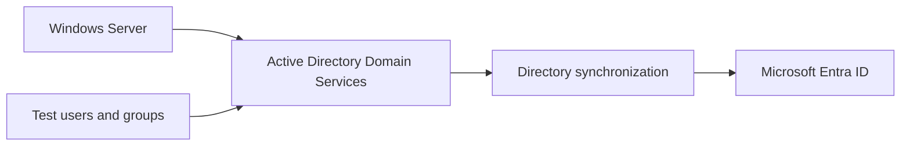

## NorthStar Medical Group: Hybrid Identity Synchronization
Project status: Planned / In progress
Scenario: Fictional healthcare organization
Purpose: Hands-on IAM lab connecting on-premises Active Directory with Microsoft Entra ID

 
## Project Overview
NorthStar Medical Group has been managing employee accounts in a Windows Server Active Directory environment. As the organization expands its use of cloud services, its IT team needs on-premises identities to be available in Microsoft Entra ID.
In this fictional lab, I will prepare a small hybrid identity environment, configure directory synchronization, and validate that selected test users and groups appear in Entra ID with the expected information. I will document the setup, validation results, and any synchronization issues I troubleshoot.
This project establishes a foundation for a separate future project focused on the Joiner-Mover-Leaver (JML) identity lifecycle.
Project Objectives
- Prepare a Windows Server Active Directory lab.
- Configure directory synchronization with Microsoft Entra ID.
- Synchronize selected test users and groups.
- Validate identity attributes and synchronization status.
- Troubleshoot and document synchronization mismatches.
- Capture screenshots and record test results.
Fictional Scenario
NorthStar Medical Group uses on-premises Active Directory to manage employee identities. The organization is adopting more cloud services and needs a consistent way to make directory information available in Microsoft Entra ID.
As the IAM Engineer in this scenario, I am responsible for building and testing the connection between the directories. I will use test accounts and groups, confirm that synchronization behaves as expected, and record how I investigate and resolve any mismatches.
Planned Architecture

## Lab Components
Component	Purpose
Windows Server	Hosts the on-premises directory services lab
Active Directory Domain Services	Stores test user and group objects
Directory synchronization tool	Synchronizes selected directory objects to Entra ID
Microsoft Entra ID tenant	Receives and displays synchronized identities
Test accounts and groups	Used to validate synchronization without real employee data

I will record the exact Windows Server version, synchronization tool, and tenant configuration after setting up the lab.

## Planned Workflow
1. Review the existing Windows Server and Active Directory configuration.
2. Prepare test users and groups with consistent identity attributes.
3. Confirm the required network, tenant, and synchronization prerequisites.
4. Configure the selected directory synchronization tool.
5. Run or monitor synchronization.
6. Confirm that expected test objects and attributes appear in Entra ID.
7. Investigate any mismatches by reviewing object attributes and synchronization status.
8. Document the results, troubleshooting steps, and evidence.

### ✅ Validation Plan

| Check | Expected result | Status |
|---|---|---|
| User sync | Test user appears in Entra ID with the expected attributes | ⏳ Pending |
| Group sync | Test group appears in Entra ID | ⏳ Pending |
| Attribute check | Key identity fields match the lab configuration | ⏳ Pending |
| Sync status | No unresolved synchronization errors | ⏳ Pending |
| Troubleshooting | A test mismatch is investigated and documented | ⏳ Pending |

Evidence and Screenshots
As I complete the lab, I will add sanitized screenshots and notes here. Screenshots will not contain passwords, access tokens, private keys, or personal information.
Suggested evidence:
- Active Directory test users and groups
- Synchronization configuration
- Synchronization status
- Matching test identity in Entra ID
- Troubleshooting notes and final validation
Security and Privacy Notes
- This is a fictional lab; it does not use real NorthStar employees or patient information.
- Only test identities will be used.
- Passwords, tokens, private keys, and other secrets will not be committed to GitHub.
- Tenant-specific values will be removed or obscured in public screenshots.
Project Status
The project is planned / in progress. I will update this README with the configuration details, screenshots, and actual test results as I build and validate the lab.
Future Project
After establishing directory synchronization, I plan to build a separate JML identity lifecycle project covering employee account provisioning, role changes, account disabling, and access revocation.
Related Project
This project builds on my Basic Employee Onboarding and AD RBAC project, which establishes the fictional NorthStar Active Directory environment and role-based access structure.
